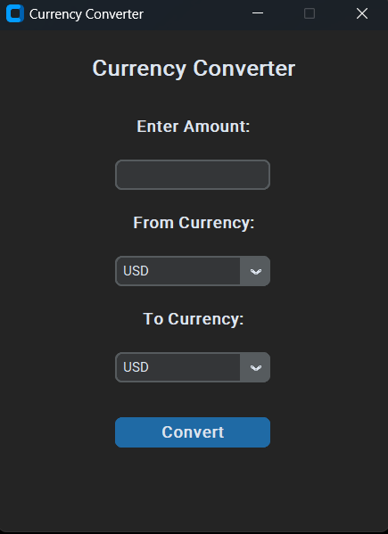

# Currency Converter Application

This is a Currency Converter application built using Python and `CustomTkinter`.
It fetches real-time exchange rates from an online API and allows users to 
convert amounts between different currencies. 

## Features
- Modern GUI built with CustomTkinter
- Real-time exchange rate fetching
- Support for multiple currencies
- Easy-to-use interface

## Technologies Used
- Python
- CustomTkinter
- Requests (for API interaction)

## Prerequisites
Ensure you have the following installed:
- Python 3 or above
- Required Python libraries: 
  - `requests`
  - `customtkinter`

## Installation
1. Clone this repository:
    ```bash
    git clone https://github.com/pavankumar444/Cloudcredits/Currency Converter Project/CurrencyConverter.git
    cd CurrencyConverter
    ```
2. Install dependencies:
    ```
    pip install requests

    pip install customtkinter
    ```

## Screenshots

